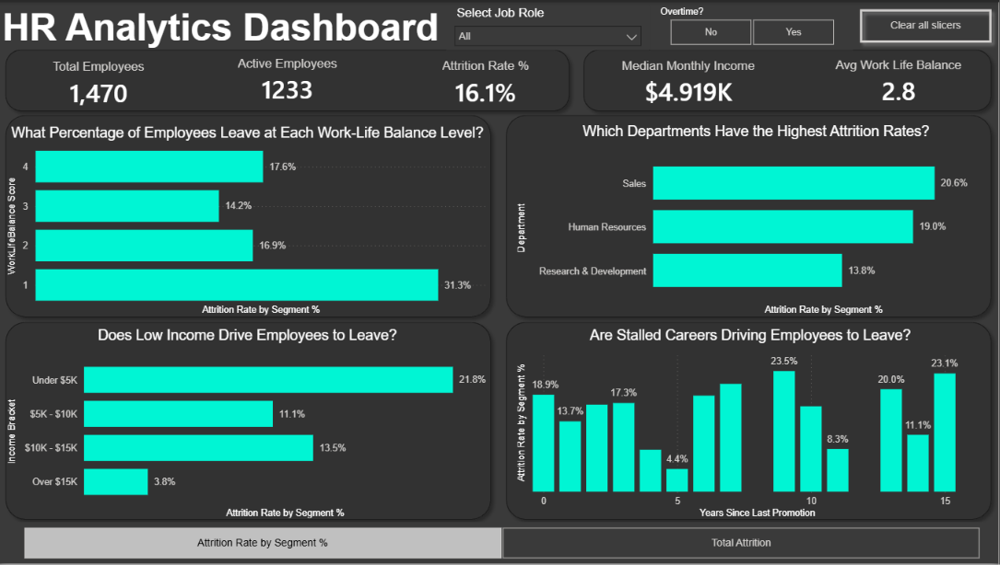

# 📊 HR Analytics Dashboard | Power BI

## 📌 Project Overview

This project analyzes employee attrition using **Power BI** to identify the key factors driving workforce turnover. The dashboard transforms raw HR data into an interactive executive report, enabling HR managers and business leaders to explore attrition trends across departments, compensation levels, career progression, overtime, and work-life balance.

The goal of this project is to demonstrate practical **Power BI**, **DAX**, and **data visualization** skills by transforming HR data into actionable business insights through interactive dashboards and executive-level reporting.

Check out the PowerBI dashboard here : [dashboard](dashboard)
---

## 🖼️ Dashboard Preview



# 🎯 Business Questions

### 👥 Workforce Overview

- How many employees are currently active?
- What is the company's overall attrition rate?
- What is the median monthly income?
- What is the average work-life balance score?

### 💰 Compensation Analysis

- Does employee income influence attrition?
- Which salary brackets experience the highest employee turnover?

### 📈 Career Progression

- How does time since the last promotion affect attrition?
- Are stalled careers contributing to employee turnover?

### ⚖️ Work-Life Balance

- How does work-life balance affect employee retention?
- Which work-life balance ratings have the highest attrition?

### 🏢 Department Analysis

- Which departments experience the highest attrition?
- Which departments require the greatest retention efforts?

---

# 📂 Dataset

The dashboard is built using an HR employee dataset containing information about:

- 👤 Employee demographics
- 🏢 Departments
- 💼 Job roles
- 💰 Monthly income
- 📈 Years since last promotion
- ⏰ Overtime
- 😊 Work-life balance
- 🚪 Employee attrition

---

# 🛠️ Tools & Technologies

- 📊 Power BI Desktop
- 🧮 DAX (Data Analysis Expressions)
- 🔄 Power Query
- 📈 Data Modeling
- 🎨 Dashboard Design
- 🌿 Git
- 📂 GitHub

---

# 📁 Repository Structure

```text
📦 POWERBI_HR_ANALYTICS_DASHBOARD
│
├── 📁 dashboard
│   └── 📊 HR_Analytics_Dataset_Dashboard.pbix      # Power BI dashboard
│
├── 📁 data
│   └── 📄 WA_Fn-UseC_-HR-Employee-Attrition.csv    # Source dataset
│
├── 📁 images
│   └── 🖼️ Dashboard.png                           # Dashboard preview
│
└── 📘 README.md                                   # Project documentation
```

---

# 🧠 Power BI Skills Demonstrated

## 🔹 Data Preparation

- Data cleaning
- Data transformation
- Data categorization
- Custom calculated columns
- Custom sorting

---

## 🔹 Data Modeling

- Building relationships between tables
- Optimizing the data model
- Creating a business-friendly semantic model

---

## 🔹 DAX (Data Analysis Expressions)

- Measures
- Calculated Columns
- Variables
- SWITCH()
- CALCULATE()
- DIVIDE()
- Field Parameters
- Dynamic KPIs

---

## 🔹 Dashboard Development

- KPI Cards
- Interactive Slicers
- Dynamic Visuals
- Cross-filtering
- Custom Navigation
- Executive Dashboard Design

---

## 🔹 UI / UX Design

- Executive dashboard layout
- Dark theme
- Consistent color palette
- Information hierarchy
- Business-focused storytelling

---

# 📊 Key Insights

### 💰 Compensation

- Employees earning **under $5K/month** have the highest attrition rate (**21.8%**).
- Attrition decreases consistently as employee income increases.
- Employees earning **over $15K/month** have the lowest attrition rate (**3.8%**).

---

### 📈 Career Growth

- Employees who have not received a promotion for **7–9 years** experience the highest attrition.
- Promotion stagnation appears to be a major contributor to employee turnover.

---

### ⚖️ Work-Life Balance

- Employees with the lowest work-life balance rating experience an attrition rate exceeding **31%**.
- Better work-life balance strongly correlates with improved employee retention.

---

### 🏢 Departments

- **Sales** has the highest attrition rate (**20.6%**).
- **Human Resources** follows closely at **19.0%**.
- **Research & Development** demonstrates the strongest employee retention among major departments.

---

# 🚀 Dashboard Features

- 📊 Executive KPI cards
- 🎛️ Interactive Job Role slicer
- ⏰ Overtime filter
- 🔄 Dynamic Field Parameter toggle
- 📈 Interactive charts
- 🎯 Cross-filtering between visuals
- 🧹 One-click slicer reset

---

# 📈 Business Recommendations

### 💰 Review Compensation Strategy

Focus salary reviews and retention initiatives on lower-income employees, where attrition is highest.

---

### 📈 Improve Career Development

Introduce structured promotion reviews and clearer career progression paths for employees approaching mid-career.

---

### ⚖️ Enhance Work-Life Balance

Reduce excessive overtime and improve workload management to increase employee satisfaction and retention.

---

### 🏢 Prioritize High-Risk Departments

Develop targeted retention strategies for Sales and Human Resources to reduce turnover.

---

# 🎓 What I Learned

Through this project I strengthened my ability to:

- Build professional Power BI dashboards
- Design efficient data models
- Write reusable DAX measures
- Develop interactive reports
- Create executive KPI dashboards
- Transform HR data into actionable business insights
- Apply dashboard design best practices


---

# 👨‍💻 Author

**Ayoub Larbi**

This project was completed as part of my data analytics portfolio to demonstrate Power BI, DAX, data modeling, and business intelligence skills.
